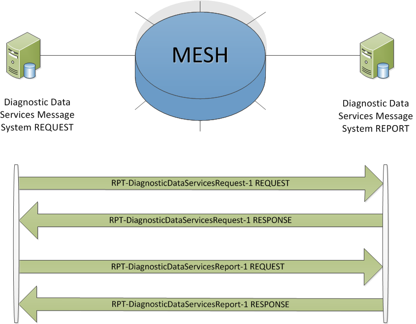

## FHIR Messaging Implementation and Architecture ##

**Diagnostic Data Services**

This section provides Diagnostic Data Services implementers with the information required to utilise the Diagnostic Data Services Domain Message Specification. 

**RPT-DiagnosticDataServicesReport-1 Interaction** 

The sender (Request Fulfiller) will construct a Diagnostic Data Services Report message and send it to the receiver (Request Placer) system.

- **Sender:** (Request Fulfiller):Diagnostic Data Services Report Message Originating System
- **Receiver:** (Request Placer):*Diagnostic Data Services Request Message Originating System
- **Message:** **Wire Format**: DiagnosticDataServicesReport-1

**Diagnostic Data Services Interaction Diagram**

The diagram shows the Diagnostic Data Services Interactions:

  